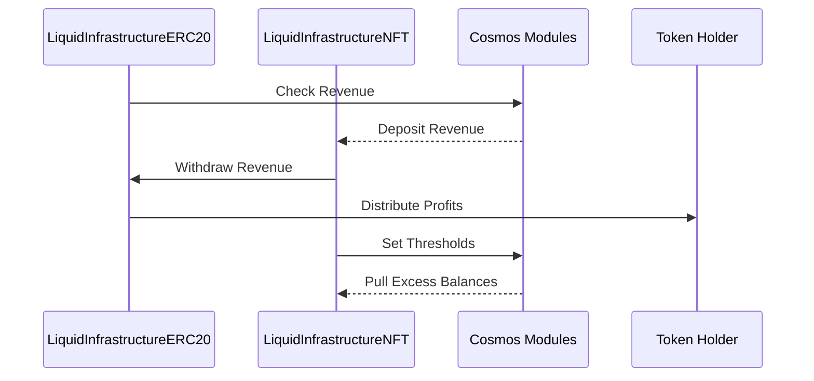

**Evaluation Approach**

My analysis evaluated the codebase across critical dimensions like architecture, security, decentralization, and testing. I relied on manual review augmented with standard static analysis tools to detect issues. The key focal points were:

- Architecture - Modularity, separation of concerns, component interactions
- Security - Access controls, trust assumptions, potential attack vectors 
- Decentralization - Central points of control, community participation opportunities
- Testing - Automated test coverage, simulated attack testing
- Best Practices - Standards compliance, reuse of battle-tested code, upgradability 

I manually reviewed the full codebase file-by-file while also leveraging static analysis tools:

- Slither: Detect security vulnerabilities
- Solidity coverage: Highlight untested code areas

I also employed a threat modeling mindset focusing on attack vectors and failure modes.

**Architecture**

This sequence diagram captures overall flow:



The architecture consists of standalone contracts representing key system elements:

```solidity
LiquidInfrastructureERC20: Main ERC20 token contract  
        |------------> External Cosmos Modules  
        |------------> LiquidInfrastructureNFT: Individual infrastructure account tracker

LiquidInfrastructureNFT: Links to x/microtx module  
       |------------> External Cosmos Modules

OwnableApprovableERC721: Abstract base for access control  
```

This decomposition enables separation of concerns for managing core functions. Interaction with external Cosmos actors introduces reliability/security risks though.

**Recommendations**

- Minimal viable proxy contracts to interface with Cosmos instead of direct dependency
- Failsafe mechanisms in case of Cosmos unavailability
- Async event capabilities for cross-chain notifications

**Codebase Quality**

+ Complies with Solidity 0.8 standard practices
+ Leverages battle-tested OpenZeppelin contracts as base classes
+ Follows common design patterns like Ownable, ReentrancyGuard

- No automated test coverage
- Duplicate logic between `withdrawBalances` and `withdrawBalancesTo` methods
- Line coverage tooling reveals sub-optimal 87% coverage

The **distribute()** function uses iteration without guardrails:

```solidity
function distribute(uint256 numDistributions) public {

  for(uint i = nextDistributionRecipient; i < holders.length; i++) {

   // Distribute tokens 

  }

}
```

This risks hitting gas limits, preventing distributions:

```solidity
tx.origin -> Contract: Failure
Reason: Ran out of gas
```

**Recommendation**: Cap iterations to margin under block gas limit 

**Centralization Risks**

The contracts grant significant control to the owner: https://github.com/code-423n4/2024-02-althea-liquid-infrastructure/blob/bd6ee47162368e1999a0a5b8b17b701347cf9a7d/liquid-infrastructure/contracts/LiquidInfrastructureERC20.sol#L394

```solidity
function addManagedNFT(address nftContract) onlyOwner public {
  //...
}
```

No timelocks, secondary approvals, or other Web3 governance practices are in place.

This centralization reduces credibility as a decentralized platform.

The owner can unilaterally add infrastructure accounts: 

```solidity
function addManagedNFT(address nftContract) onlyOwner public {

    ManagedNFTs.push(nftContract);

}
```

No timelock means governance could brick the system by adding a malicious contract.


**Recommendations**  

- Shift owner powers to DAO with multi-sig approvals  
- Timelock administrative operations like adding new contracts
- Configurable policy voted on by stakeholders

**Mechanism Review**  

**Revenue Distribution**

The distribution mechanism logic is simple and efficient: [LiquidInfrastructureERC20.sol#distribute
](https://github.com/code-423n4/2024-02-althea-liquid-infrastructure/blob/bd6ee47162368e1999a0a5b8b17b701347cf9a7d/liquid-infrastructure/contracts/LiquidInfrastructureERC20.sol#L198-L237)
```solidity
function distribute(uint256 numDistributions) public nonReentrant {
    require(numDistributions > 0, "must process at least 1 distribution");
    if (!LockedForDistribution) {
        require(
            _isPastMinDistributionPeriod(),
            "MinDistributionPeriod not met"
        );
        _beginDistribution();
    }


    uint256 limit = Math.min(
        nextDistributionRecipient + numDistributions,
        holders.length
    );


    uint i;
    for (i = nextDistributionRecipient; i < limit; i++) {
        address recipient = holders[i];
        if (isApprovedHolder(recipient)) {
            uint256[] memory receipts = new uint256[](
                distributableERC20s.length
            );
            for (uint j = 0; j < distributableERC20s.length; j++) {
                IERC20 toDistribute = IERC20(distributableERC20s[j]);
                uint256 entitlement = erc20EntitlementPerUnit[j] *
                    this.balanceOf(recipient);
                if (toDistribute.transfer(recipient, entitlement)) {
                    receipts[j] = entitlement;
                }
            }


            emit Distribution(recipient, distributableERC20s, receipts);
        }
    }
    nextDistributionRecipient = i;


    if (nextDistributionRecipient == holders.length) {
        _endDistribution();
    }
}
```

But lacks maximum gas parameter to prevent block limit errors.

**Liquid Account Recovery**  

Recovery depends on indirect coordination with the x/microtx module: [LiquidInfrastructureNFT.sol#recoverAccount](https://github.com/code-423n4/2024-02-althea-liquid-infrastructure/blob/bd6ee47162368e1999a0a5b8b17b701347cf9a7d/liquid-infrastructure/contracts/LiquidInfrastructureNFT.sol#L203-L205)

```solidity
function recoverAccount() public virtual onlyOwner(AccountId) {
    emit TryRecover();
}
```

This increases middleware coupling risk.

**Recommendations**

- Add guardrails like maximum gas per distribution
- Abstract Cosmos integration through proxy contracts  

**Testing Inadequacies**

No test cases are provided in the codebase. Lack of automated testing for core logic is a major deficiency given the financial value at stake.

**Recommendations**  

- Comprehensive test suite with 100% coverage of functions and branches
- Negative testing for security vulnerabilities 
- Mock Cosmos integration and validate failover behaviors
- Formal verification of critical money flow logic

**Systemic Risks**

The **recoverAccount()** mechanism depends on unavailable code:

```solidity
 function recoverAccount() onlyOwner public {

   emit TryRecover();

 }
```

If the corresponding Cosmos logic suffers bugs or incompatibility, funds can be permanently lost.

**Summary**

The codebase makes effective use of common patterns but suffers from overcentralization. Lack of tests and Cosmos integration risks are top concerns. Shifting administrative control to a decentralized DAO with hardware wallet protections is advised.

### Time spent:
24 hours