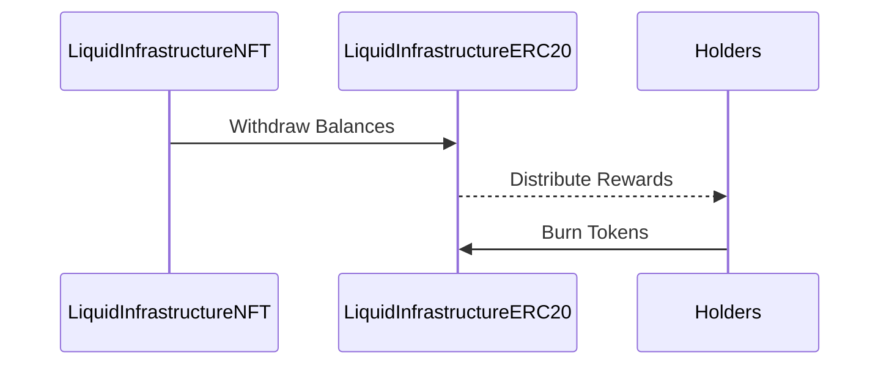

### My analysis involved:

- Manual code review: Looking for security flaws, access controls, adherence to standards 
- Architecture analysis: Separation of concerns, centralization risks
- Attack surface review: Trust assumptions, incentive compatibility  
- Test coverage assessment: Logic branches, functionality

#### Architecture
The core architecture centers around two key contracts:

```solidity
LiquidInfrastructureERC20.sol
     |
     |- Manages distribution logic
     |- Holds balances to distribute
	
LiquidInfrastructureNFT.sol
     |	
     |- Tokenizes real world assets
     |- Holds revenue balances
```

**Interaction Diagram:**



This shows the balance accumulation and distribution flow.

*Positive Aspects*

- Minimal attack surface area: Only critical functionality in contracts
- Modular/extensible: Core ERC20/721 building blocks  
- Access controls: Allowlists, distribution locking, owner-only functions

*Improvements*

- Decouple distribution control from ERC20 token into own DistributionManager contract
- Introduce administrator roles to provide governance without central owner control

**Quality/Security**

*Positive Aspects* 

- Use of OpenZeppelin security focused libraries
- Access controls on distribution state 
- Input validation on external data

*Concerns*

- Overreliance on `LockedForDistribution` state variable for security
- Lack of test coverage for distribution quirks/edge cases 
- No formal proofs or verification done

**Centralization Risks**
  
- Owner controls minting/management of core tokens
- Allowlist maintained on-chain leads to some centralization  

*Mitigations*

- Make owner-only functionality relay on Chainlink VRF
- Implement allowlist/governance through an on-chain DAO

**Recommendations**

1. Formal verification of core distribution logic
2. Decentralize governance through an AccessControlManager contract + DAO
3. Increase test coverage of edge cases
4. Add redundancies/hardware checks before critical state changes


### Time spent:
19 hours